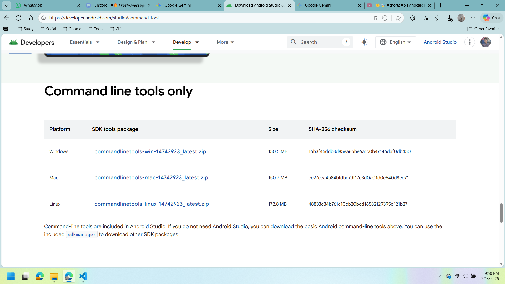
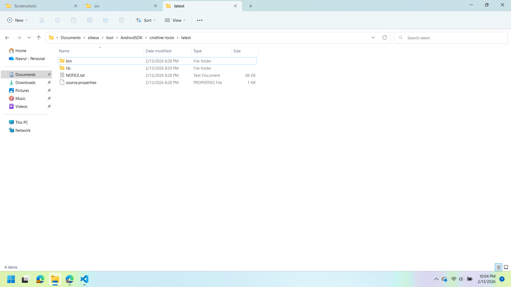
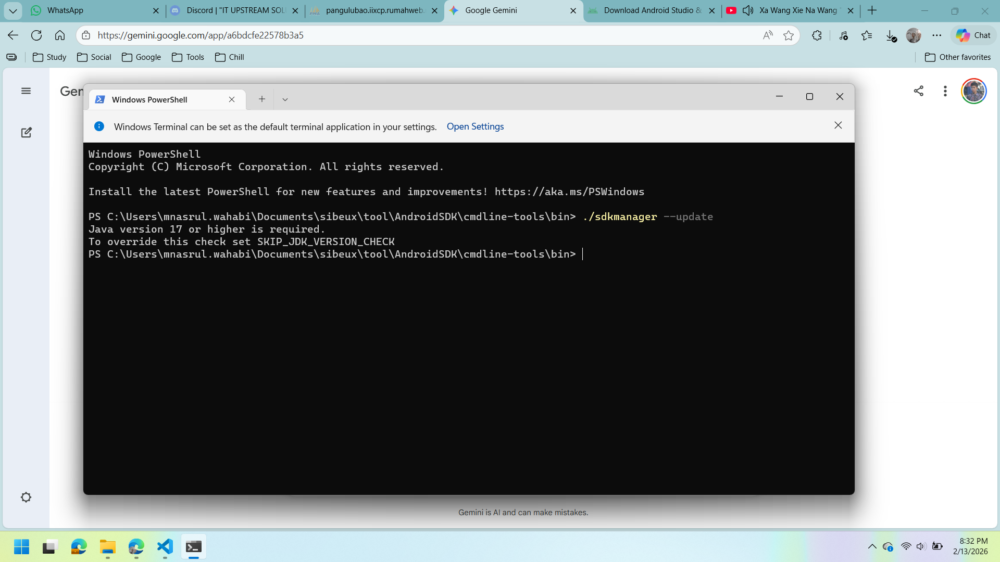
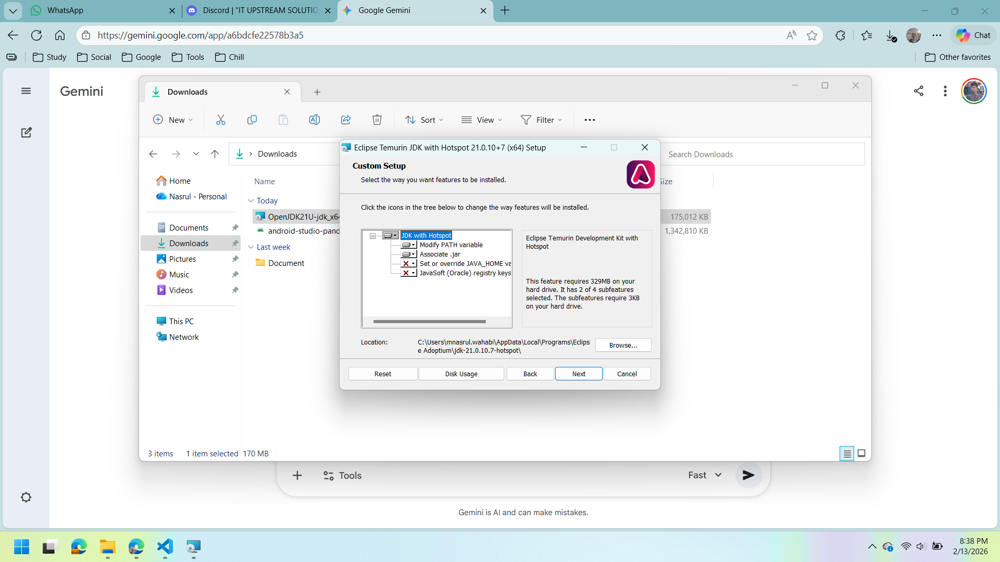
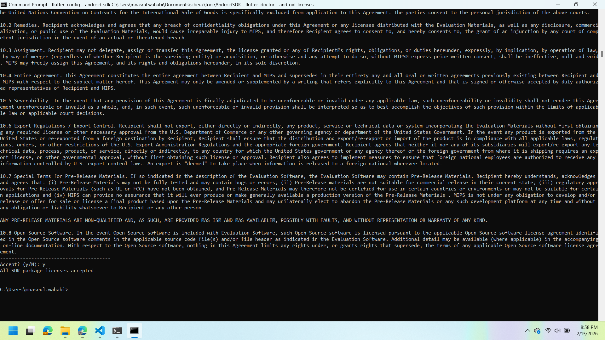
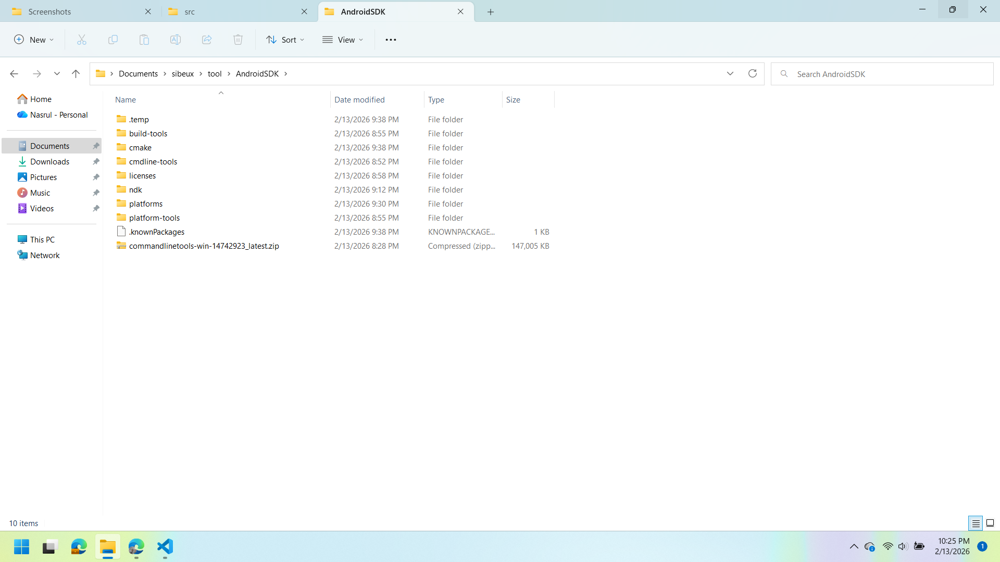
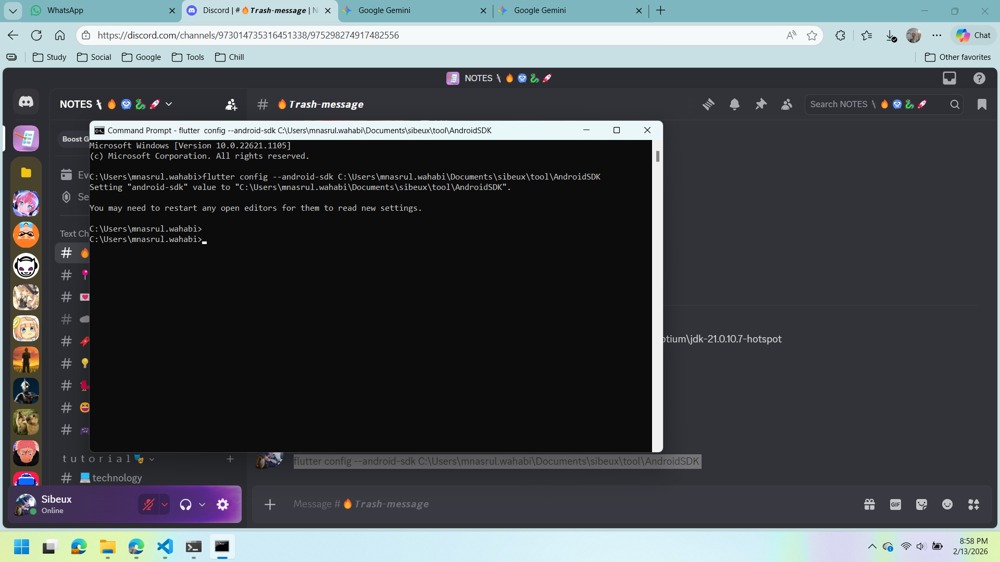
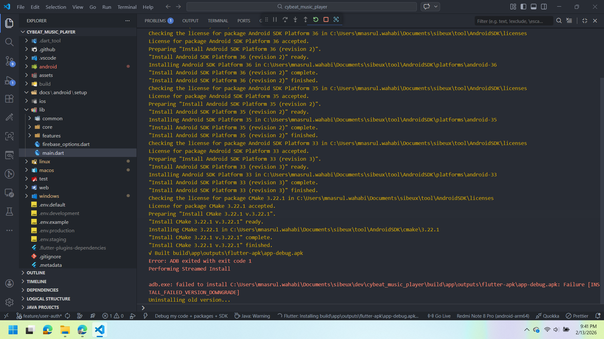

# CLI BASED INSTALLATION OF ANDROID SDK

Original source: <https://gemini.google.com/app/a6bdcfe22578b3a5>

## Problem

Hp fisik Android tidak terdeteksi di laptop baru. Setelah run `flutter doctor`, muncul error "Android toolchain - develop for Android devices: Unable to locate Android SDK". Artinya adalah Android SDK belum terinstall di laptop baru.
Ada beberapa cara untuk menginstall Android SDK, salah satunya adalah dengan menginstall Android Studio. Namun, karena Android Studio membutuhkan spesifikasi laptop yang cukup tinggi.

## Solution

Maka beralih untuk menginstall Android SDK menggunakan command line interface (CLI) yang disediakan oleh Android SDK Manager. Berikut adalah langkah-langkah untuk menginstall Android SDK menggunakan CLI:

## 1. **Download Android SDK Command Line Tools**

Download Android SDK Command Line Tools dari situs resmi Android Developer: <https://developer.android.com/studio#command-tools>. Cari bagian "Command line tools only" dan download sesuai dengan sistem operasi yang digunakan (Windows, Mac, atau Linux).



## 2. **Ekstrak file zip**

Ekstrak file zip yang telah di-download ke directory yang diinginkan. Misalnya, di Windows bisa diekstrak ke `"C:\Users\mnasrul.wahabi\Documents\sibeux\tool\AndroidSDK\cmdline-tools\"`

## 3. **Tambahkan folder `latest` di dalam dir cmdline-tools (recommended)**

Folder `bin` dan file lainnya akan berada di dalam folder `latest`, seperti ini: `"C:\Users\mnasrul.wahabi\Documents\sibeux\tool\AndroidSDK\cmdline-tools\latest\bin"`



## 4. **Masuk ke folder bin dan run command**

Masuk ke dir `"C:\Users\mnasrul.wahabi\Documents\sibeux\tool\AndroidSDK\cmdline-tools\latest\bin"`, lalu run command berikut:

``` bash
./sdkmanager --update
```

## ⚠️ **Error `Java version 17 or higher is required` (possible)**

Jika muncul error seperti di atas, artinya versi java di laptop masih versi lama. Solusinya adalah dengan menginstall JDK versi 17 atau lebih tinggi. Pada kasus ini, jdk yang diinstall adalah OpenJDK 21 by Adoptium: <https://adoptium.net/en/temurin/releases/?version=21>

### Pesan error yang muncul adalah seperti berikut



### Install JDK 21



## 5. **Konfigurasi Java Environment (Sesi Sementara)**

Karena laptop baru punya project yang perlu java 8 dan tidak boleh diubah, maka JDK 21 akan di-setup khusus saat cmd ini dijalankan. Untuk setting-nya, bisa run command berikut:

### *Arahkan ke lokasi JDK 21 yang sudah diunduh/ekstrak*

``` bash
set JAVA_HOME=C:\Users\mnasrul.wahabi\AppData\Local\Programs\Eclipse Adoptium\jdk-21.0.10.7-hotspot

set Path=%JAVA_HOME%\bin;%Path%
```

Pastikan saat menjalankan command di atas, terminal yang dipakai adalah Command Prompt (cmd), bukan PowerShell atau terminal lainnya.

## 6. **Download platform tools**

Di terminal yang sama, run command berikut untuk mendownload platform tools:

``` bash
sdkmanager "platform-tools" "build-tools;34.0.0" "platforms;android-34"
```

Pastikan setelah proses download selesai, akan muncul folder `platform-tools`, `build-tools`, dan `platforms` di dalam directory Android SDK.

### Proses download berjalan seperti berikut



### Folder `platform-tools`, `build-tools`, dan `platforms` yang sudah terdownload



## 7. **Install Android license**

Di terminal yang sama, run command berikut untuk menginstall license Android SDK:

``` bash
flutter doctor --android-licenses
```

## 8. **Setup Flutter Config**

Hal ini dilakukan agar Flutter bisa mendeteksi Android SDK yang sudah diinstall. Run command berikut di terminal:

``` bash
flutter config --android-sdk C:\Users\mnasrul.wahabi\Documents\sibeux\tool\AndroidSDK
```



Setelah semua langkah di atas dilakukan, coba run `flutter doctor` lagi di terminal. Jika semua langkah dilakukan dengan benar, maka Android SDK sudah terinstall dan terdeteksi oleh Flutter. Test build project Flutter ke device Android fisik yang sudah terhubung ke laptop.


